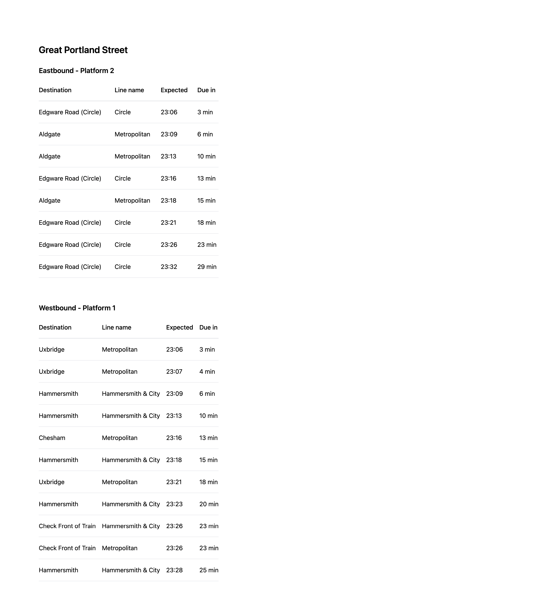

# Live Tube Arrivals

Rails app that displays the next trains due at "Great Portland Street underground station", using the [Transport for London Unified API](https://api.tfl.gov.uk/).



## What it does

- Resolves the station name "Great Portland Street" to a station ID via the TfL [StopPoint Search API](https://api-portal.tfl.gov.uk/api-details#api=StopPoint&operation=StopPoint_SearchByQueryQueryQueryModesQueryFaresOnlyQueryMaxResultsQueryLine)
- Fetches live arrival predictions for that station via the TfL [StopPoint Arrivals API](https://api-portal.tfl.gov.uk/api-details#api=StopPoint&operation=StopPoint_ArrivalsByPathId).
- Display the trains by platform order by due trains, with platform information for each train.


## Running it locally

### Requirements

- Ruby `3.3.11`
- Rails `7.2.3`
- Bundler `2.5.3`

A `.ruby-version` file is included for [rbenv](https://github.com/rbenv/rbenv).
Clone the repo and run `bin/dev` to start the app:
```bash
git clone https://github.com/punitcse/tfl-app.git
cd tfl-app
```

```bash
# Install dependencies
bundle install
bin/dev
```

Alternatively, run the two processes manually in separate terminals:

```bash
bin/rails server -p 3000
bin/rails tailwindcss:watch
```

Open <http://localhost:3000> in your browser.

### Running the tests

```bash
bundle exec rspec
```

## How it works

The app resolves the station name "Great Portland Street" to a station ID via TfL's StopPoint Search API, then fetches live arrivals for that ID. Arrivals are grouped by platform names with the direction (for example Eastbound - Platform 1), sorted by next due train time.

The main code lives in three places:

- `SearchStation` performs the name => stations ids lookup. It is cached for 24 hours since station IDs don't change frequently.
- `FetchArrivals` fetches the live data. Not cached, arrivals are live data so it doesn't make sense to cache.
- `Arrival` is a Struct that wraps a single TfL prediction, with display helpers and normalises the raw response.

## Design notes

1. **Caching is asymmetric on purpose.** 
Station IDs are permanent, so cache them long. Arrivals are live, so don't cache them. For a multi-user production deployment I'd add a short say 5 seconds arrivals cache to coalesce concurrent requests under TfL's rate limit, but with dev app scale it's not worth.

2. **Net::HTTP rather than Faraday.** Two endpoints don't justify a gem. Retry middleware doesn't really help inside a synchronous request anyway, if TfL is degraded, retrying just makes the user wait longer for the same empty state. Tight timeouts (2s open, 5s read) protect the request thread. 
On failure the view degrades to an empty state rather than 500 error.

3. **Search matching.** TfL's search returns multiple results for a query. `SearchStation` looks for an exact name match first, then falls back to the first tube-mode result.

4. **`Arrival` is a Struct, not ActiveRecord.** Arrivals are transient nothing to persist. The Struct normalises TfL's response once so the rest of the app works with consistent objects.

## What's not built

- **Auto-refresh.** Scoped out for time. The `_arrivals` partial is already extracted; a Turbo Frame with a polling Stimulus controller would work in without too many changes.
- **Last-known-good fallback.** During a TfL outage, the page goes empty. In production I'd cache the most recent successful response separately and serve it stale with a "last updated X ago" message.
